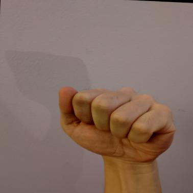
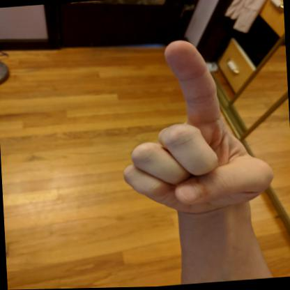
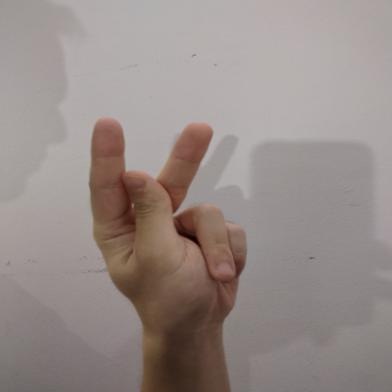

# American Sign Language (ASL) Recognition

This project detects and recognizes **American Sign Language (ASL) letters** in real-time using a **YOLOv8-based object detection model**.
It can recognize hand gestures from a live webcam feed and save the output video.

---

## Features

* 🔴 Real-time ASL recognition via webcam
* 🤖 YOLOv8-based object detection model
* 📦 Trainable on custom datasets using Roboflow integration
* 🎥 Saves detection results as video output

---

## Dataset

We used the **[American Sign Language Letters Dataset (Roboflow)](https://public.roboflow.com/object-detection/american-sign-language-letters/1)**.

📊 **Dataset details:**

* 8,700+ labeled images
* 29 classes (A–Z letters + special signs)
* Annotated with bounding boxes around hands
* Split into training, validation, and test sets

Here are some sample images from the dataset:

  
  
  

---

## Why YOLOv8?

We chose **YOLOv8** for this project because:

* ⚡ It provides **real-time performance**, perfect for webcam-based applications
* 📉 It supports **tracking**, making gesture recognition more stable
* 🔧 Easy to train on custom datasets with **Roboflow integration**
* 🧩 Lightweight models (e.g., `yolov8n`) allow fast inference even on limited hardware

---

## Installation

Clone the repository:

```bash
git clone https://github.com/AmirSalajegheh/ASL.git
cd ASL
```

Install required Python packages:

```bash
pip install -r requirements.txt
```

---

## Usage

### Webcam Detection

Run the `main.py` script to start real-time recognition from your webcam:

```bash
python main.py
```

Detected letters will be shown on the screen and saved in `asl_detection.mp4`.

### Training the Model

You can train a YOLOv8 model on the ASL dataset using the provided Jupyter notebook `training.ipynb`.

You can refer to `test.gif` as an example input/output visualization.

---

## Author

Developed by **Amir Salajegheh** 🚀
